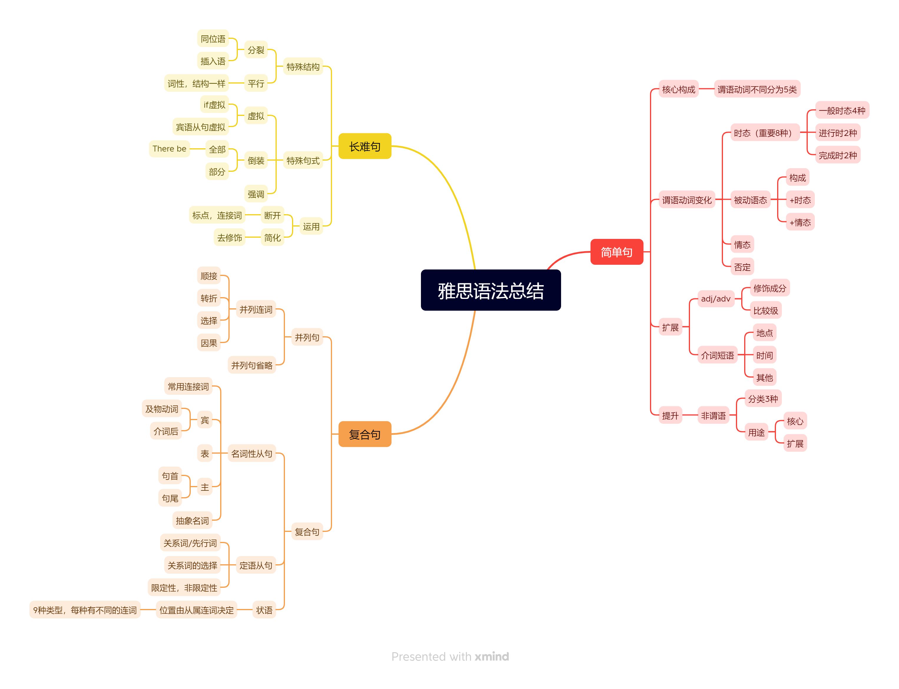

> ⚠️本打卡表默认为北京时间 UTC+8 时区，正确格式如下：
>
> timezone: Asia/Shanghai
>
> ⚠️如果你所在地区非北京时间，请根据你所在时区自行更改，请注意填写的正确格式。
>
> 时区请参考以下列表：
>
> timezone: Asia/Shanghai # 中国标准时间 (UTC+8)
>
> timezone: Asia/Tokyo # 日本标准时间 (UTC+9)
>
> timezone: Pacific/Auckland # 新西兰标准时间 (UTC+12)
>
> timezone: Australia/Sydney # 澳大利亚东部标准时间 (UTC+10)
>
> timezone: Pacific/Honolulu # 夏威夷-阿留申标准时间 (UTC-10)
>
> timezone: America/Anchorage # 阿拉斯加标准时间 (UTC-9)
>
> timezone: America/Los_Angeles # 太平洋标准时间 (UTC-8)
>
> timezone: America/Denver # 山地标准时间 (UTC-7)
>
> timezone: America/Chicago # 中部标准时间 (UTC-6)
>
> timezone: America/New_York # 东部标准时间 (UTC-5)
>
> timezone: America/Halifax # 大西洋标准时间 (UTC-4)
>
> timezone: America/St_Johns # 纽芬兰标准时间 (UTC-3:30)
>
> timezone: America/Sao_Paulo # 巴西利亚时间 (UTC-3)
>
> timezone: Atlantic/Azores # 亚速尔群岛时间 (UTC-1)
>
> timezone: Europe/London # 格林威治标准时间 (UTC+0)
>
> timezone: Europe/Berlin # 中欧标准时间 (UTC+1)
>
> timezone: Europe/Helsinki # 东欧标准时间 (UTC+2)
>
> timezone: Europe/Moscow # 莫斯科标准时间 (UTC+3)
>
> timezone: Asia/Dubai # 海湾标准时间 (UTC+4)
>
> timezone: Asia/Kolkata # 印度标准时间 (UTC+5:30)
>
> timezone: Asia/Dhaka # 孟加拉国标准时间 (UTC+6)
>
> timezone: Asia/Bangkok # 中南半岛时间 (UTC+7)

# 英语残酷共学第 2 期残酷指引

> 正式开始前请确保你在身体上和精神上都处于合适的状态，请刻意练习，残酷面对 🆒。 报名需要按要求认真填写下面 [ YourName ] 自我介绍部分，方便大家互相认识，报名通过审核即可开始自主学习。

# [Ayden]

"Hello everyone, my name is AydenWu.I am a backend developer currently learning front-end development and English, hoping to find a remote job."

## Do you think you will finish the whole CoLearning program?

[Yes 100%]

---

**共学节奏参考：**

- [**A-Programmers-Guide-to-English**](https://github.com/yujiangshui/A-Programmers-Guide-to-English) 重新认识英语这门语言 ❤️ 预计 1 天，已学的可忽略
- [**从 0 开始学习英语语法**](https://hzpt-inet-club.github.io/english-note/) 构成英语的基石：语法 ❤️ 预计 1 天，已学的可忽略
- [**每日英语听写 Daily English Dictation 1-400**](https://www.bilibili.com/video/BV1U7411a7xG?p=3&vd_source=bc0666711d2280c24d54945ab9c11146) 「听写」对于「听和说」是最有效的方式 ❤️ 预计 18 天，进度是每天至少 2-5 节，每次听写尽量写出来具体的内容，可以总结生词/概述所学/复盘。最后 1 天对本期残酷共学复盘总结
- 其它：扩展资料或其它你认为适合自己的英语学习资料。

**CP 组队：**  希望大家主动认识，互相监督学习和打卡，好好享受这 21 天英语共学之旅。

**Notes Proof ：** 格式仅供参考

- 问题思考示例：
  - 英语音标发音有哪些值得注意的（易错的或难读的）？
  - 英语听说读写哪个板块你比较擅长或者不擅长，基于自己情况制定学习计划，和大家交流的方向？
- 听写笔记示例：
  - Dictation：将自己听到的内容记下。
  - Fix: 对照原句看看哪些听错了进行标记并总结，比如：是单词不认识、还是发音不熟悉、或是断句不正确、或是其它。

⚠️ **当你提交笔记时，请注意本文档格式，否则打卡可能会失败：**

- 笔记证明 Notes Proof 下方的 `<!-- Content_START -->` 和` <!-- Content_END -->` 不要删除。
- 每天的学习证明记录格式：以时间年月日 `### 2024.10.08` 作为标题开头，以此类推。

---

## 笔记证明 Notes Proof

<!-- Content_START --> 

### 2024.10.08
#### 总结 
    简易的英语学习器像一个英语学习大纲，列举了语言学习中的重要要素。
    1. 学习知识的时候能够迅速对应到大纲中，知道有助于哪部分提升。
    2. 语言学习重点：语料库扩展。
    3. 每个人学习英语目标不一样，可以根据自身的需求选择自己的训练资料做规划。
  
  - 识别英语的程序
	- 听力识别器
		- 口音识别器（各个国家发音）
		- 语言特性识别器（连读，弱读）
		- 上下文缓存器（从上下文理解句子和单词的意思）
	- 视力识别器
		- 图形识别器（识别能力和精准度）
		- 上下文缓存器
	- 核心理解器
		- 语料库（音标，字母，单词，发音，一词多义，熟词僻义，同义词，反义词）
		- 识别引擎（语法，句型句式，惯用表达）
		- 思维能力（思考总结能力）
	- 口语表达器
		- 意图语料组装器（目的+语料+语法+地道的表达）
		- 发音器（语料库的发音）
	- 书写表达器
		- 意图语料组装器
		- 书写表达器（单词拼写）
- Benchmark+抱着怀疑态度学习
	- 语料库，口音，读音：积累
		- 不同单词分重点：发音，听力，拼写错误，新单词，相似音，连读
	- 语法：单点突破
	- 意图语料组装器：转述，训练逆向组装能力

### 2024.10.09
## 总结
	把田静雅思语法课里的思维导图搬运过来了，回顾了一下语法课里的内容和语法的重点。
	https://www.youtube.com/watch?v=mMYn9HDVrZc&list=PLhoVEsDqZpyr_roiIlhz2nOPCbwGasDgn&index=32

	精听Daily English Dictation 1的内容，脑海里回忆起了精听雅思的材料时听不懂的痛苦记忆，决定这次学习计划不做精听。
	自己现阶段主要目标是准备面试英语，准备找一些技术性的视频和文档去学习，能够坚持下去很重要。

### 2024.10.10
## 总结
	找了三份视频材料:ReactConf,Code BootCamp, Free BootCamp最终选择了Free BootCamp的React视频内容。发音清晰，视频内容难易程度合适。复习巩固React知识和用法的同时，练习听力。
	决定通过每天的视频学习做一个react的讲解PPT，PPT要求有
	1. 每天不少于3-5页
	2. PPT内容简洁，口述部分整理成文字记录方便以后改进
	3. 从最简单开始
 
### 2024.10.11
- ReactDOM is a moudule within React library that is used to map React Components to the DOM in browser environments.
- ReactDOM provides a series of APIs that allow developers to create and manage React Components in the browser.
- ReactDOM allow developers to construct user interface using a declarative approach.
- Through the use of virtual DOM and effcient DOM update algorithms,ReactDOM can significantly improve application performance,especially in large-scale applications.
- React’s declarative programming model makes the code more readable and maintainable.
- JSX is used in React for describing the structure of UI components.It closely resembles HTML,but is actually embedding into JavaScript , allowing you to write HTML-like syntax with your JavaScript code.
- JSX allows you to write what looks like HTML within your JavaScript files, making it easier for developer with HTML experience to understand the structure of components.
- It’s easy for developers to read and underdtand the UI structure of an application.

### 2024.10.12
- A functional component is a React component defined as a plain JavaScript function.
- The code for functional components is typically more concise than class components because they don't require the use of this keyword or the definition of a constructor, render method, etc.
- With Hooks, functional components can now have state and other React features.
- Functional components generally have better performance than class components because they do not require class instantiation or method binding.
- Due to the conciseness of functional components, they are more easily optimized by modern JavaScript toolchains through tree-shaking, reducing the final bundled code size.

### 2024.10.13
### 2024.10.14
- Inline styles in React are written as JavaScript objects where the key is the camelCased version of the CSS property and the value is the CSS value.
- Inline styles are particularly useful for dynamically changing styles based on component state or props.
- Inline styles do not support pseudo-classes or media queries directly.
- Props enforce a unidirectional data flow, meaning that data is passed down from parent to child.
- Props are different from state in that props are immutable and should not be changed directly within the component. State, on the other hand, is mutable and is managed by the component itself.
- When props passed to a component change, React will re-render that component with the new props.
- You can also pass functions as props, which can be invoked within the child component to perform actions or computations.
  
### 2024.10.15
- React Class Components are a way to create components with more complex logic and state management. They are defined using the class keyword in JavaScript, extending React.Component.
- Class components provide a clear and structured set of lifecycle methods that allow you to perform side effects at specific points in the component's lifecycle.
- While functional components with hooks can also manage state, class components have a more straightforward approach to state management and passing down props.
- Class components allow you to define instance variables that are not directly related to the UI.
- Despite these advantages, it's worth noting that React has been moving towards functional components with hooks as the primary way to build components due to their simplicity and the ability to use state and other React features without the need for a class. 

### 2024.10.16
- State is an object that holds information about the component that can change over time.
- When the state is updated, React automatically re-renders the component to reflect the changes.
- Props (short for properties) are similar to state but are passed down from parent components to child components.
- Event handling is the process of specifying what should happen when a user interacts with your application.
- Event handling in React is designed to be declarative and straightforward, making it easier to manage user interactions in your applications.
  
### 2024.10.17
- React components have several lifecycle methods that allow you to run code at specific points in a component's lifecycle.
- These methods can be categorized into three main phases:Mounting,Updating,Unmounting
- It's worth noting that with the introduction of React Hooks, many developers now prefer using functional components with hooks like useEffect() instead of class components with lifecycle methods.
- Conditional rendering in React refers to the practice of displaying different content based on certain conditions or states within your application.
- Conditional rendering allows you to create dynamic user interfaces that respond to changes in data or user interactions.
  
### 2024.10.18
- Controlled Components:In React, form elements such as <input>, <textarea>, and <select> typically maintain their own state.
- Uncontrolled Components:In some cases, you might want to use uncontrolled components where form data is handled by the DOM itself. You can use a ref to get form values from the DOM.
- Multiple Input Handling:When dealing with multiple inputs, you can add a name attribute to each element and let the handler function choose what to do based on the event.target.name.
- Forms in React give you fine-grained control over user input and allow you to create dynamic, interactive user interfaces. The controlled component pattern, while sometimes more verbose, provides a clear, predictable way to manage form state in your React applications.

### 2024.10.19
- Components encapsulate specific functionality and UI elements, making the code more organized and easier to maintain.
- Once created, components can be reused throughout an application, promoting consistency and reducing code duplication.
- Smaller components can be combined to create more complex UI structures, allowing for a hierarchical organization of the interface.
- Components help separate the UI logic from the business logic, improving code readability and testability.
- Components can have their own state, which represents data that can change over time, and props, which are inputs passed from parent components. The component lifecycle includes methods for mounting, updating, and unmounting, allowing developers to hook into different stages of a component's existence.

  
### 2024.10.20
## 总结
	学习完react概念，新手项目进度80%，写代码的过程中似乎对理论要求不高。接下来会将重点用在原生js学习和youtobe区react项目。
 - Declarative Code: React allows you to write UIs in a declarative way, which makes it easier to reason about your application's state and output.
 - Components: The basic building blocks of React applications are components. Components can be class-based or functional, and they can be either stateful or stateless.
 - JSX: React uses JSX, a syntax extension that looks like HTML but is actually embedded JavaScript, to describe what the UI should look like.
 - State: Encapsulated data within a component that, when changed, re-renders the component.
 - Props: Read-only data passed down from a parent component to a child component
 - Hooks: Introduced in React 16.8, hooks allow you to use state and other React features without writing a class.
 - Context API: A way to pass data through the component tree without having to pass props down manually at every level.
 - Redux: A popular state management library that can be used with React to manage state more predictably.
 - Virtual DOM: React maintains a virtual representation of the actual DOM, which allows it to optimize and minimize the number of costly DOM manipulations.
 - Reconciliation: The process by which React updates the DOM efficiently by comparing the previous and next render of components.
 - Keys: A unique identifier for list items when rendering dynamic lists to help React identify which items have changed, been added, or been removed.
 - Fragments: A way to return multiple elements from a component without adding extra nodes to the DOM.
 - Events: React attaches event handlers to components using a camelCase naming convention and automatically handles event propagation.
 - Refs: A way to get a direct reference to a DOM node or a React element created in a component.
 - Higher-Order Components (HOCs): A pattern for reusing component logic by wrapping a component in another component.
 - Error Boundaries: Components that catch JavaScript errors anywhere in their child component tree, log those errors, and display a fallback UI.
 - Server-Side Rendering (SSR): The ability to render React components on the server and send HTML to the client, which can improve SEO and performance.
 - Testing: React provides a testing library that makes it easy to write unit tests for components.
 - Ecosystem: React has a vast ecosystem of tools and libraries, including Create React App for bootstrapping new projects, React Router for navigation, and various UI component libraries.

### 2024.10.21
- Variables and Data Types: JavaScript has several data types, including numbers, strings, booleans, objects, arrays, and functions. Variables are declared using var, let, or const.
- Operators: JavaScript supports a variety of operators, such as arithmetic operators (+, -, *, /), assignment operators (=, +=, -=), comparison operators (==, !=, >, <), and logical operators (&&, ||, !).
- Control Flow: JavaScript uses conditional statements (if-else, switch) and loops (for, while, do-while) to control the flow of execution.
- Functions: Functions are reusable blocks of code that can take parameters and return values. They can be defined using the function keyword or as arrow functions.

### 2024.10.22
- Objects: JavaScript objects are collections of key-value pairs. They can be created using object literals, constructed using the Object() constructor, or defined as classes.
- Arrays: Arrays are ordered collections of values. They can store elements of different data types and provide various methods for manipulating and accessing their contents.
- Array Methods: JavaScript arrays have a rich set of built-in methods, such as push(), pop(), slice(), map(), filter(), and reduce(), which make working with arrays more efficient.

### 2024.10.23
- Syntax and Basic Constructs:
	Variables: Declared with let, const, and var.
	Data Types: Primitive (e.g., string, number, boolean) and non-primitive (objects, arrays, functions).
 	Operators: Arithmetic, comparison, logical, assignment, etc.
  	Control Structures: if, switch, for, while, do-while, break, continue.
- Functions:
	Declaration: Function expressions and function statements.
	Scope: Local, global, block scope (with let and const).
	Higher-order Functions: Functions that can take other functions as arguments or return them.
	Callback Functions: Functions passed into other functions as parameters.

### 2024.10.23
### 2024.10.23
### 2024.10.23
### 2024.10.23
### 2024.10.23

<!-- Content_END -->
